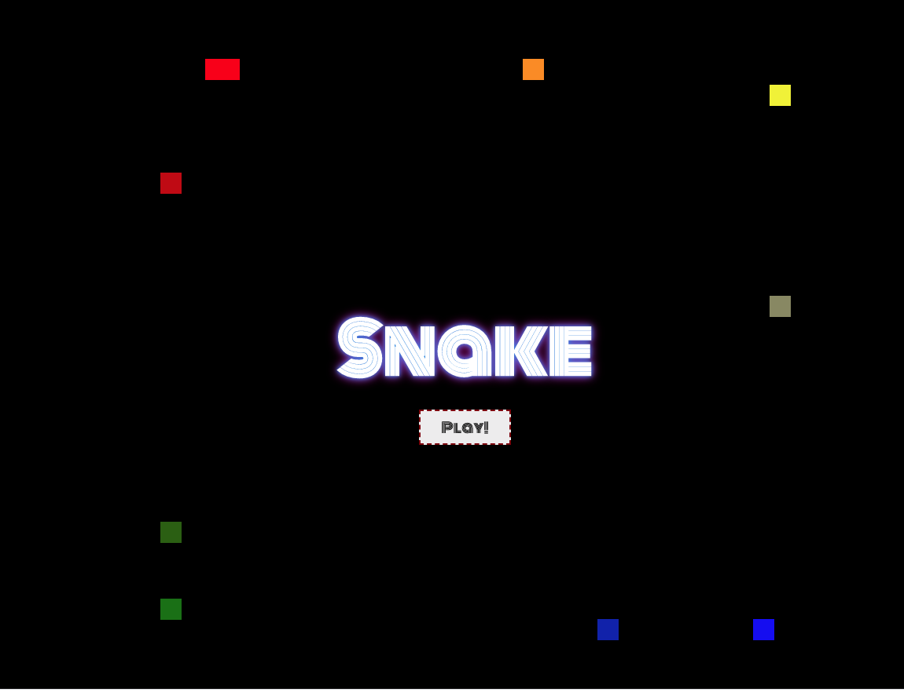
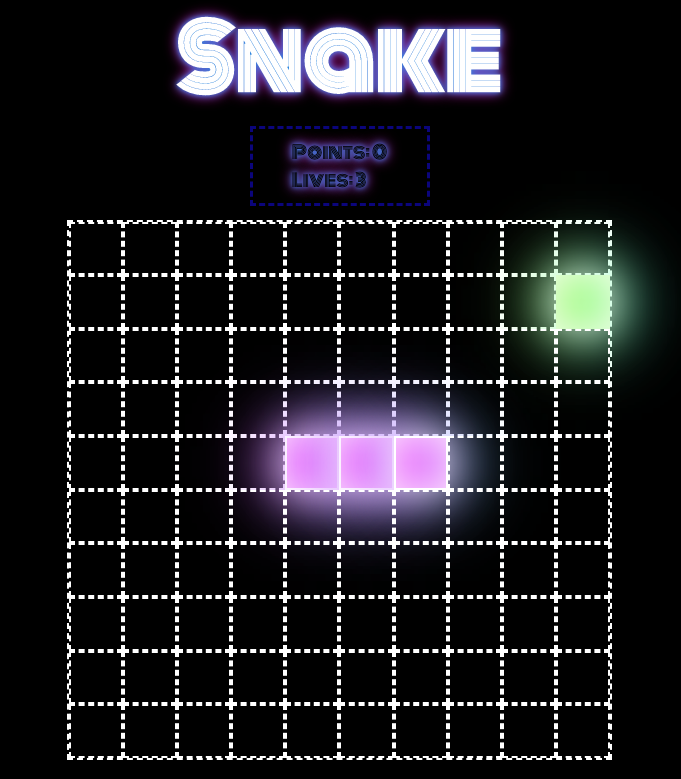

# project-1

# Project 1 - Snake

# Overview

This is the first project that I completed on the software enginnering immersive course at GA, London. The aim of the task was to interact with the DOM, incorporating the CSS, HTML and JavaScript skills we had learnt to create a grid-based game. The game had to be completed independently over the course of a week.

Given the list of archaic games, I chose to build Snake. The neon design and music chosen aims to make the game feel fun and exciting when played. 

You can play the game [here](https://larathompson.github.io/project-1/), or find the GitHub repository [here](https://github.com/larathompson/project-1). 


## Brief: 

Snake is a single-player game where the player earns points by guiding the snake to eat food randomly placed on the game board. Each item of food the snake eats the longer it grows. The game is over if the snake hits the edge of the board, or itself. To make things even more challenging, the snake increases speed as its gets longer!

The aim of the game is to stay alive as long as possible.

# Technical Requirements

The app must: 
- Render a game in the browser
- Design logic for winning and visually display which player won
- Include separate HTML / CSS / JavaScript files
- Stick with KISS (Keep It Simple Stupid) and DRY (Don't Repeat Yourself) principles
- Use JavaScript for DOM manipulation
- Deploy your game online where the rest of the world can access it
- Use semantic markup for the HTML and CSS 

# Game-specific Requirements

* The snake should be able to eat food to grow bigger
* The game should end when the snake hits the wall or itself
* Snake speeds up as it eats more

# Technologies Used

- HTML
- Javascript (ES6)
- CSS
- CSS Animations
- Google Fonts
- DOM
- Downloaded Sounds
- Git and GitHub

# Approach

## Choosing to Play

When the player initially loads the page, the grid is hidden and a clickable button gives the user the option to play the game. On this page, I created a neon-glow effect by using animations and shadows in CSS to give the effect of the words pulsating on the page. Additionally, to create the effect of a snake moving and following each other around the page, I created animated divs which moved around the page for different durations. Although I thought the impact of this was visually effective, on reflection, I would have thought of a more efficent way to design this animation. 





```
#square1 {
  animation: track 2s linear infinite;
}
#square2 {
  animation: track 2.01s linear infinite;
}
#square3 {
  animation: track 2.02s linear infinite;
} 
#square4 {
  animation: track 2.03s linear infinite;
} 
#square5 {
  animation: track 2.04s linear infinite;
} 
#square6 {
  animation: track 2.05s linear infinite;
} 
#square7 {
  animation: track 2.06s linear infinite;
}
#square8 {
  animation: track 2.07s linear infinite;
}
#square9 {
  animation: track 2.08s linear infinite;
} 
#square10 {
  animation: track 2.09s linear infinite;
} 

/* animations */

@keyframes track {
  
  0%   {background-color:red; left:20%; top:10%;}
  25%  {background-color:yellow; left:80%; top:10%;}
  50%  {background-color:blue; left:80%; top:90%;}
  75%  {background-color:green; left:20%; top:90%;}
  100% {background-color:red; left:20%; top:10%;}
}


@keyframes neonGlow {
   0% {
    text-shadow: 0px 0px 9px #0097e8, 0px 0px 15px #f50abe, 0px 0px 5px #f50abe;
  }
  85% {
    text-shadow: 0px 0px 9px #0097e8, 0px 0px 15px #f50abe, 0px 0px 5px #0097e8;
  }
} 
```

When the player clicked the play button, this animation stopped, the grid appeared, the music started playing and the lives/points board apeared. Additionally, the boolean value of playing, whcih was initally set to false (`let playing = false`) changes to be set to `true`. This was used to ensure that the play button could not be pressed twice, as if playing was already true, it would return before executing the subsequent code. 

```
playButton.addEventListener('click', () => {
    introductionMusic()   
    grid.style.display = 'flex'
    header.style.display = 'flex'
    removeMovingSquares()
    playButton.style.display = 'none'


    if (playing) return
    playing = true

```




## The Grid 

The game is played on a grid. To maximise efficiency whilst making this grid, I used HTML create 10 divs (for each cell of the grid), then a I used a JavaScript `for` loop to populate the DOM with a 10 x 10 grid comprised of cells. Each of these cells were 10% of the grid height and width and styled with CSS. Each cell has an index value between 0-99 - this meant I could access the positions of the snake and the food which was necessary to determine the games functionality. 

```
for (let i = 0; i < width ** 2; i++) {
    const div = document.createElement('div')
    div.classList.add('cell')
    grid.appendChild(div)
    cells.push(div)
  }
```


At the start of the game, the position of the snake on the grid was represented using an array (` let snakePositions = [44, 45, 46]`) and the snake's movement is controlled by the user pressing the arrow keys. The direction in which the snake moves is stored in a object - this was necessary to ensure that specific event listeners were activated/ deactivated given the direction that the snake was moving in (eg. you can only press the left/right arrow key when the snake is moving up/down). I used the `forEach` method on the array of the snake positions, adding a class to them which demonstrated to the player where the snake was. 

```
 const direction = Object.freeze({
    NONE: 'none',
    LEFT: 'left',
    RIGHT: 'right',
    UP: 'up',
    DOWN: 'down'
  })
  let currentDirection = direction.NONE
```

Additionally, a piece of 'food' appeared on the board each time the game was started or a game was lost - the aim of the game was for the snake to 'eat' this food by having the snakes 'head' (the final cell value of the snake positions array) to be the same as the food. The use of this `while loop` ensures that the food position could not be the same as the snake position - if it was, a new food position had to be generated and only then, could the classList of food be added (this set the cell to green, representing a piece of food)
```
function showRandomFood() {
      foodPosition = Math.floor(Math.random() * cells.length)
      while (snakePositions.indexOf(foodPosition) !== -1) {
        foodPosition = Math.floor(Math.random() * cells.length)
      }

      cells[foodPosition].classList.add('food')
    }
  ```

  # Playing the game

  In order to control the direction in which the snake moves, the arrow keys are pressed. Each of these keys have event listeneners on and different functions are run depending on the direction that the snake is initially moving, the location where the snake is on the board and the number of lives that the player has. For each key pressed, the following events can happen (I will use the 'up' arrow key as an example):

```
   if (event.key === 'ArrowUp' && (currentDirection !== direction.UP) && (currentDirection !== direction.DOWN)) {
          clearInterval(snakeInterval)
          snakeInterval = setInterval(() => {
            if (snakeHead < width && liveCount === 1) {
              endGame()
              clearInterval(snakeInterval)

              return
            } else if (snakeHead < width && liveCount > 1) {
              liveReset()
              renderGame()
              resetSpeed()
              clearInterval(snakeInterval)


            } else {
              snakeUp()
              growSnake()
              collision()
              currentDirection = direction.UP
            }
          }, speed)
```

This key down events are only activated if the snake is currently moving left or right. When activated, the previous `set interval` is cleared (this prevents multiple set intervals running simulatenously). Alternatively, when the snake is moving up/down the board, only the right/left arrow keys are activated. 

As shown above, when the snake is moving left/right across the grid and the up arrow is pressed, the following results can occur: 
- arrow up results in end of game
- arrow up results in loss of life
- arrow up results in snake moving vertically up the board
- arrow up results in collision with food


# Arrow up results in end of game 
  If the user hits the wall by pressing the up arrow (`snakeHead < width && liveCount === 1`) and they only had one life, the game is ended. 

  The `endGame()` function takes the user to results page. Here, the DOM is used to hide the grid and show the user the number of points they scored, whilst giving them the option to play again. The points are displayed by using the DOM to change the `inner.HTML` of the points (the user scores +100 points for every bit of food eaten). The boolean value of 'playing' is also reassigned to be false. This means that the player is given the option to play again. The other variables that were reassigned during the previous game are also reset in order to return the game to its default settings eg. speed, snake positions, lives and points. 

  # Arrow up results in loss of life 

  If the user hits the wall by pressing the up arrow and they have more than one life. They lose a life, return to the default speed and the snake position gets set to the default position (this makes use of the render game function). 

  As shown below, the `liveReset()` function revoves one of the players 3 lives and updates the live count in the `inner.HTML` of the live count display box. Every time the user loses a life, the snake game is reset so that the user starts again from the middle of the board. The direction is also set to its default value (none) and the music which signifies a collision is played. 

  ```
  function liveReset() {
      liveCount -= 1
      lives.innerHTML = 'Lives: ' + liveCount
      snakePositions = [44, 45, 46]
      snakeHead = snakePositions[snakePositions.length - 1]
      currentDirection = direction.NONE
      clearInterval(snakeInterval)
      playLostMusic()
    }
```

# Arrow up results in snake moving up
  If the user safely clicks the arrow up button whilst travelling left or right, the snake moves around the corner in order to transition from moving horizontally to moving vertically:

  ```
  function snakeUp() {
      snakeHead = snakePositions[snakePositions.length - 1] - width
      snakePositions.shift()
      snakePositions.push(snakeHead)

      renderGame()
    }
```

A particular challenge of this project was calculating how best to change the direction of the snake so that when the snake head moved round the corner, the rest of the body followed. In this example, to move the snake up, the first element in the snake positions array (the back of the snake) was removed (`snakePositions.shift()`) and a new position was added to the front of the array (`snakePositions.push(snakeHead)`). This occurs with every set interval and therefore, the snake appears to move around the corner until it is moving vertically, unless another arrow key is pressed. 

Additionally, the `growSnake()` function is called. This detects whether the snake collides with the food and if so, will play the sound associated with this collision, grow the snake by one square, add 100 to the points score, increase the speed of the snake and also regenerate another piece of food randomely on the board. 

# Set intervals 

All of these functions run with set intervals which run in accordance to the speed. The set interval is cleared at the beginning of each function to stop the previous function running. The set interval is initially set to 800ms and every time food is eaten, the speed increases by 20% of the speed and when a life is lost, the speed resets to its default value. 

# Music

I chose to add sounds to my game which I found online, downloaded and linked to the document. In order to ensure that when the game was played again, the song started from the beginning, I used the `introMusic.currentTime = 0`. 

# Lessons learnt

This project gave me the opportunity to combine everything I had learnt in the first 3 weeks of this course into one project. I became more confident at learning how to debug code, using CSS animations and working with the DOM to provide interactive webpages that respond to the user. Additionally, I learnt the importance of testing every time you add additional features and the importace of using `console.log` to debug code. I developed my ability to plan a project and work to meet deadlines. Furthermore, I learnt how to present and explain code to the other members of my cohort. 

# Bugs

- The snake is only able to move right/up/down at the start. To combat this in the future, I may add a default intial movement which causes the snake to move to the right when the user clicks 'play'. 
- Occasionally when food is eaten and the length of the snake increases, the extra cell is added in the incorrect place. 

# Potential Future Features

- Mobile Compatability
- Multiple levels
- Boxes explaining instructions to the player


  

